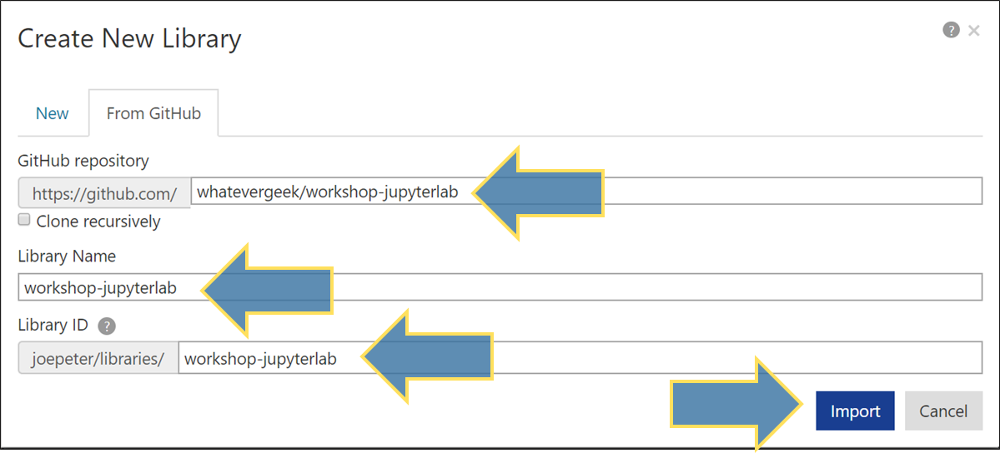
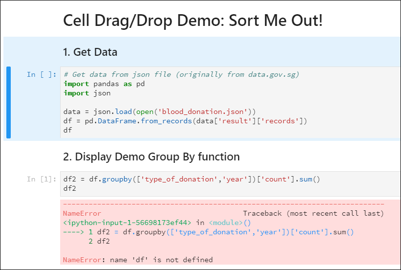

# JupyterLab Workshop
#### Prepared for Pycon APAC 2018

### Prerequisite
For this workshop, we'll leverage on the free Azure Notebooks platform so that you don't have to setup anything on your machine. 

>Azure Notebooks is a **free** service that provides Jupyter Notebooks along with supporting packages for R, Python and F#. The great thing about this service is that no downloads or lengthy setups are required. After signing up with a **Live Account**, you can start working on a notebook within minutes.

Just ensure you have a **Live Account** you can use for logging in.

- **Live Account** -  If you don't have yet, you can create one using this link: https://signup.live.com

### Task 1: Setup workshop materials and launch JupyterLab 
#### 1. Go to https://notebooks.azure.com/ and click "Sign in".

    

#### 2. Sign in using your live account.

>#### Note: If it's your first time accessing Azure Notebooks, you'll be prompted to supply a "User Id". Just fill accordingly and click "Save".
>

#### 3. Click the "Libraries" tab.

#### 4. Click "+ New Library"

#### 5. Click "From GitHub" tab.
>Azure Notebooks platform allows you to create a library from scratch (blank). However, for the purpose of this workshop, we'll create the library from an existing GitHub repository.     

#### 6. Fill in the form using the following values and click "Import".
* Github Repository: https://github.com/whatevergeek/workshop-jupyterlab
* Library Name: workshop-jupyterlab
* Library ID: workshop-jupyterlab

#### 7. Click the "Libraries" breadcrumb.

#### 8. Open the library in JupyterLab.

#### 9. Once loaded, you should now see the JupyterLab interface.

#### 10. Explore JupyterLab further by completing the next tasks.    

### Task 2: Sort Cells
#### 1. From the file browser, double click “sort_me_out.ipynb” to open this notebook in a new tab.    
    

#### 2. Notice that the cells are not in order. We need to move “1. Get Data” label and its corresponding code cell up to the first position. Fortunately, JupyterLab supports dragging/dropping of cells. So this is just a breeze. Hold “shift” and select the left side area of “1. Get Data” label and its corresponding code cell. After selection, they should be highlighted like below:     
     

#### 3. Drag the highlighted portion all the way to the first position (just below the main label).    

#### 4. This is how it looks in first position.    
    

 
#### 5. Once you have it in first position, you can click “Run All Cells” from the menu.
     

#### 6. As you can see, it still runs like a normal jupyter notebook and is able to support visualizations.    
    

