# JupyterLab Workshop
#### Prepared for Pycon APAC 2018

### Prerequisite
For this workshop, we'll leverage on the free Azure Notebooks platform so that you don't have to setup anything on your machine. 

>Azure Notebooks is a **free** service that provides Jupyter Notebooks along with supporting packages for R, Python and F#. The great thing about this service is that no downloads or lengthy setups are required. After signing up with a **Live Account**, you can start working on a notebook within minutes.


Just ensure you have a **Live Account** you can use for logging in.

- **Live Account** -  If you don't have yet, you can create one using this link: https://signup.live.com


### Task 1: Setup workshop materials and launch JupyterLab 
#### 1. Go to https://notebooks.azure.com/ and click "Sign in".

    

#### 2. Sign in using your live account.


>#### Note: If it's your first time accessing Azure Notebooks, you'll be prompted to supply a "User Id". Just fill accordingly and click "Save".
>


#### 3. Click the "Libraries" tab.


#### 4. Click "+ New Library"
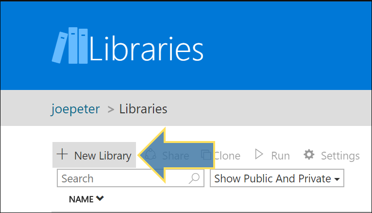

#### 5. Click "From GitHub" tab.
>Azure Notebooks platform allows you to create a library from scratch (blank). However, for the purpose of this workshop, we'll create the library from an existing GitHub repository.     
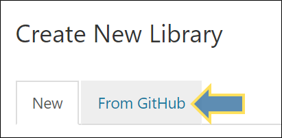

#### 6. Fill in the form using the following values and click "Import".
* Github Repository: https://github.com/whatevergeek/workshop-jupyterlab
* Library Name: workshop-jupyterlab
* Library ID: workshop-jupyterlab


#### 7. Click the "Libraries" breadcrumb.
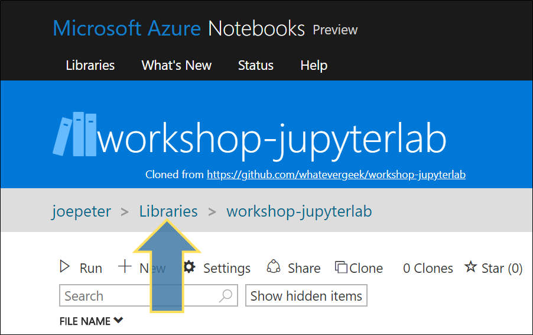

#### 8. Open the library in JupyterLab.

> Note: Only do the following steps if you encounter the following issue (i.e. Internal Server Error):
>   
> ##### a. In the "Libraries" tab, delete the library (workshop-jupyter) you just created. You may do this by right clicking the library and hitting "Delete".
> ##### b. Go to the following link: https://notebooks.azure.com/joepeter/libraries/workshop-jupyterlab    
> ##### c. Click "Clone".    
> 
> ##### d. In the Dialog Box, also click "Clone".     
> ##### e. Go back to your "Libraries" tab. 
> ##### f. Refresh the page. You should now be able to "Run in JupyterLab (a)" as per step 8.
> 
> For other issues, contact the workshop coordinator.
> 

#### 9. Once loaded, you should now see the JupyterLab interface.
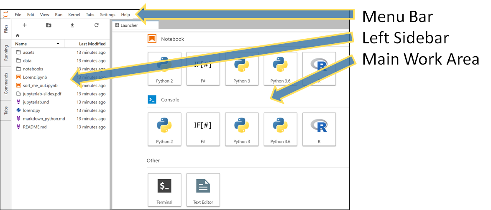

#### 10. Explore JupyterLab further by completing the next tasks.    

### Task 2: Sort Cells
#### 1. From the file browser, double click “sort_me_out.ipynb” to open this notebook in a new tab.    
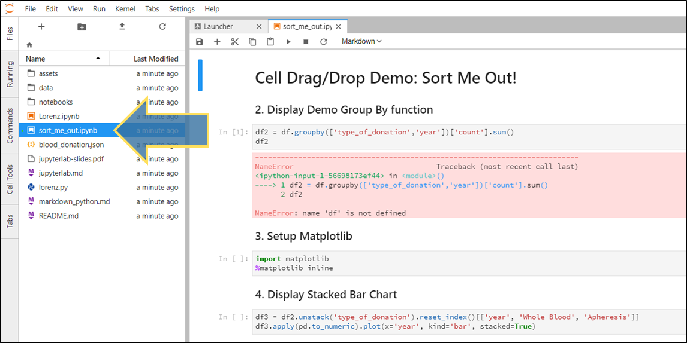    

#### 2. Notice that the cells are not in order. We need to move “1. Get Data” label and its corresponding code cell up to the first position. Fortunately, JupyterLab supports dragging/dropping of cells. So this is just a breeze. Hold “shift” and select the left side area of “1. Get Data” label and its corresponding code cell. After selection, they should be highlighted like below:     
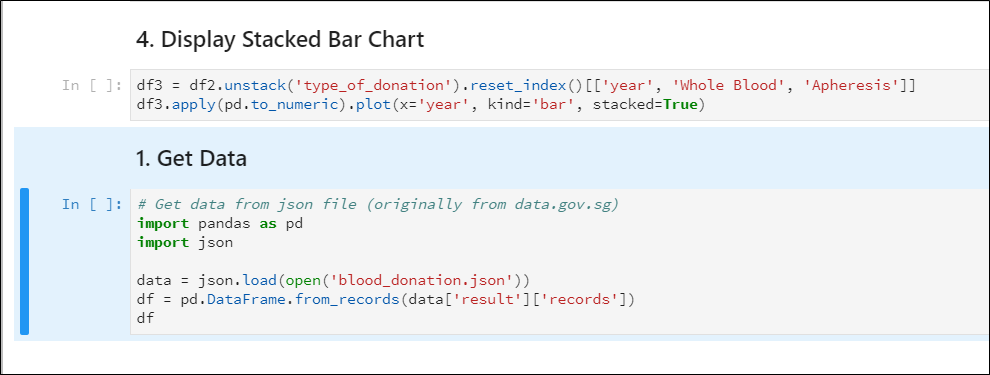     

#### 3. Drag the highlighted portion all the way to the first position (just below the main label).    


#### 4. This is how it looks in first position.    
    

 
#### 5. Once you have it in first position, you can click “Run All Cells” from the menu.
     

#### 6. As you can see, it still runs like a normal jupyter notebook and is able to support visualizations.    
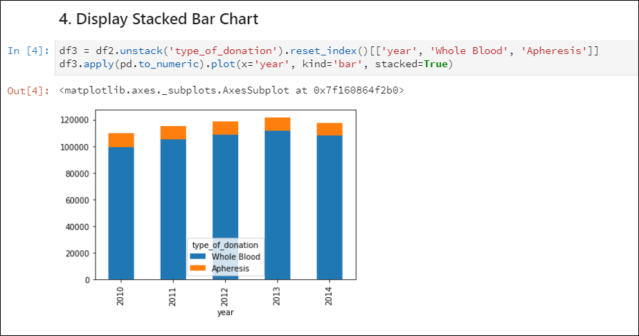    

### Task 3: Explore Graphs    
#### 1. From the file browser, double click the "notebooks" folder. Then, double click “Seaborn.ipynb” to open this notebook in a new tab.    

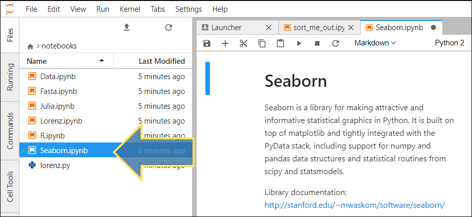    
#### 2. Click “Run All Cells” again from the menu.
#### 3. Scroll to the bottom of notebook. You can see various graphs generated except for the last cell as there’s an error.
> Note: This cell threw an error: AttributeError: 'module' object has no attribute 'corrplot'. In this version of seaborn, the corrplot() and underlying symmatplot() functions have been deprecated in favor of heatmap(). 

#### 4. Right click on the left side of that cell.
#### 5. JupyterLab supports context menus so it’s easy to manipulate cells right where we need it. Since we don't need this cell in this workshop, click “Delete Cells”


#### 6. Now, we have just what we want to see. No errors. Perhaps, not quite. Let’s collapse all code so that only graphs are displayed. Click “Collapse All Code”.    
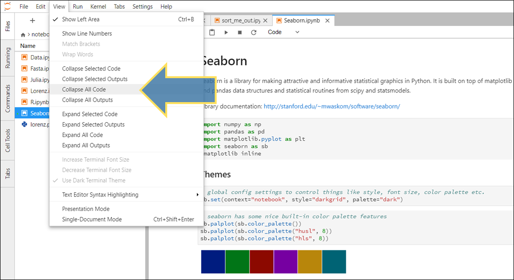    

#### 7. Now, we’re left with just the labels and visualizations. Pretty neat. Next, we want to put 2 visualizations in their own windows so we can check them easily.

#### 8. Right click the first advanced plot and click “Create New View for Output”.    
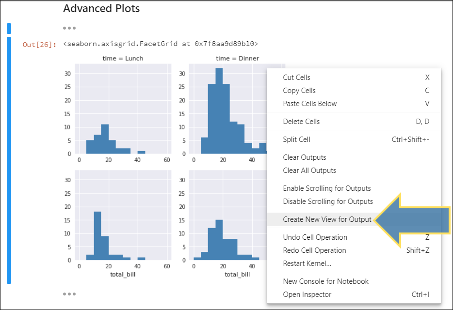    

#### 9. Do the same for the next advanced plot. You should have the following result.    

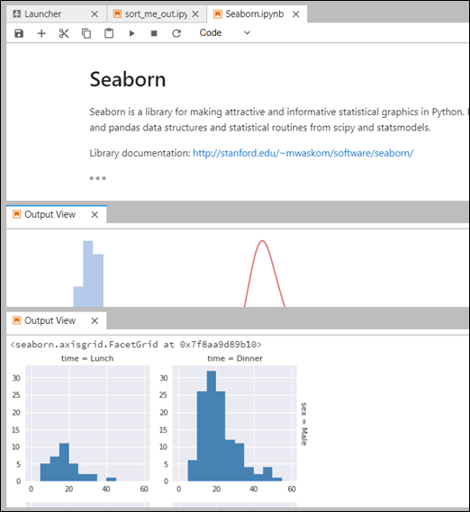

#### 9. Both output views are in awkward positions. JupyterLab allows you to drag and drop the tabs so that you can arrange them into your custom layout. Arrange the Output View as per the display below.

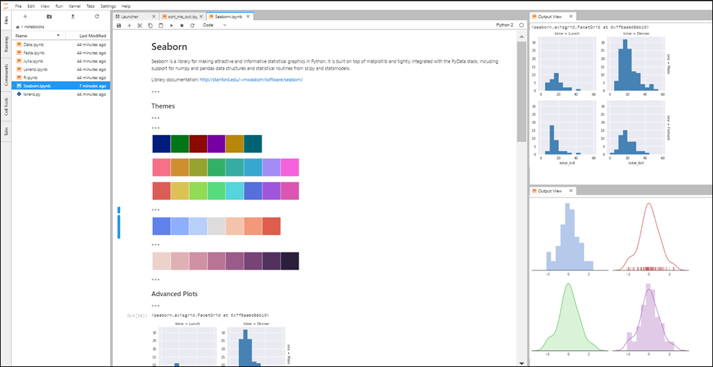

#### 10. Let’s say we want to change the data of the first advanced plot. Click on the triple dot below the "Advanced Plots" label.
    

#### 11. This will expand the code cell. Now, change the values accordingly.
    

#### 12. While inside the cell, press “Shift” + “Enter”.    

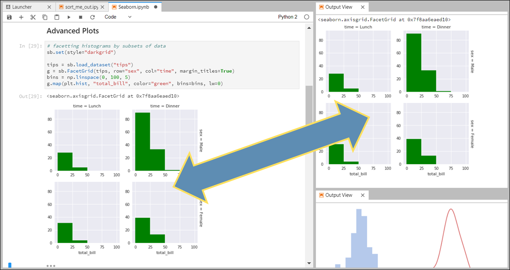    

#### 13. Notice that both graphs are updated accordingly. JupyterLab is designed to have such outputs in sync to the same model.

### Task 4: Cleanup the Workspace
#### 1. Let’s cleanup our workspace. Close all tabs.
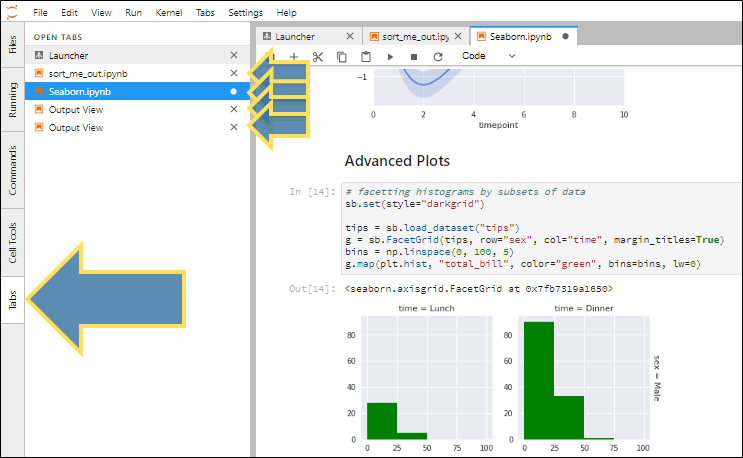    
#### 2. Shutdown all kernel sessions.    

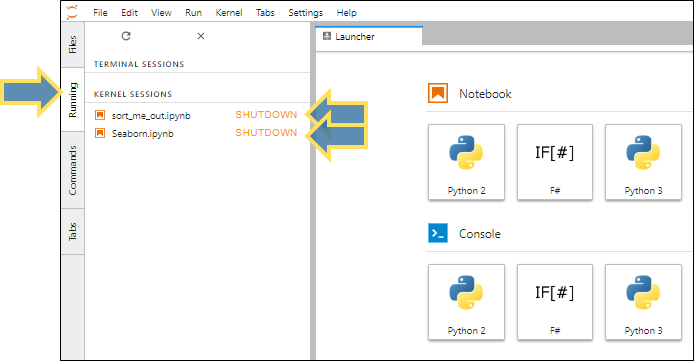    

### Task 5: Explore Markdown Features    
#### 1. In the file browser (at the home directory), right click markdown_python.md, navigate and click Editor.


#### 2. In the file browser, going back to markdown_python.md, right click markdown_python.md, and this time round navigate and click Markdown Preview instead.   
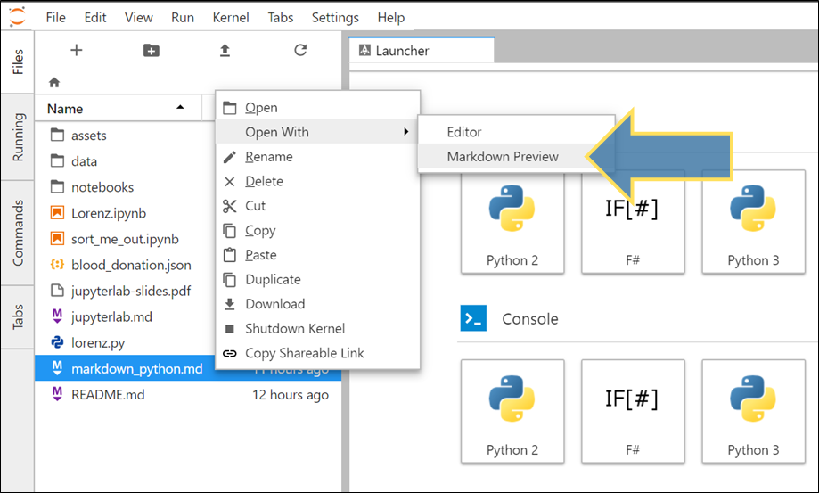

#### 3. Arrange the editor and markdown preview side by side like the layout below:    
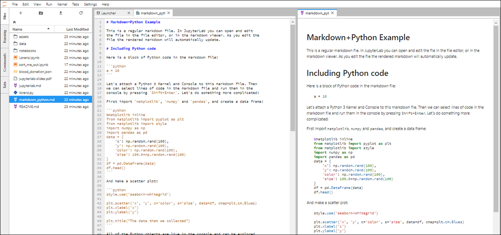

#### 4. In the editor, type the following as the first line:
```
# JupyterLab is awesome!!!
```

#### 5. Notice that the markdown preview is automatically updated as you type.
    
#### 6. Inside any part of the editor, click “Create Console for Editor”.
   
   
> If the prompt asks you for a kernel version, select Python 3.  
>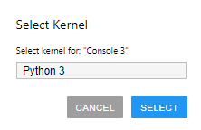
#### 7. Place your cursor to code blocks inside the markdown editor and click SHIFT+ENTER.
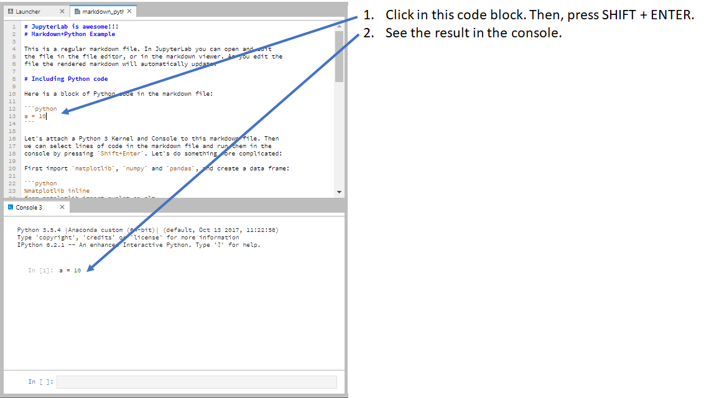    

#### 8. Do the same for the other code blocks inside the editor too.    
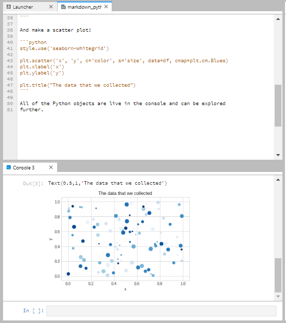

### Task 6: View in Single-Document Mode    
#### 1. Press CTRL+SHIFT+ENTER
#### 2. To view next tab, Press CTRL+SHIFT+]
#### 3. To view previous tab, Press CTRL+SHIFT+[
#### 4. To go back to multi tab view, Press CTRL+SHIFT+ENTER


### Task 7: Explore File Formats
#### 1. Cleanup your workspace (refer to Task 4)
#### 2.. In the file browser, open the data folder.    
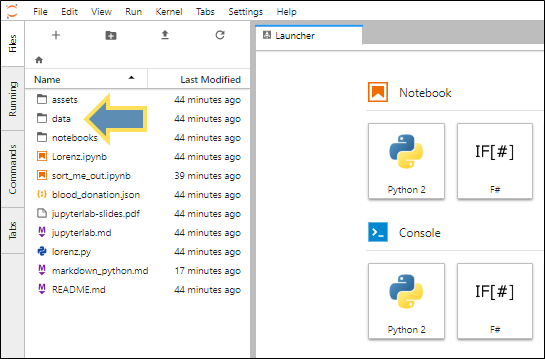    

#### 3. JupyterLab supports viewing of various formats (e.g. *.jpg, *.vl.json, *.csv, *.pdf). Drag the corresponding files into the main work area and arrange them like below.
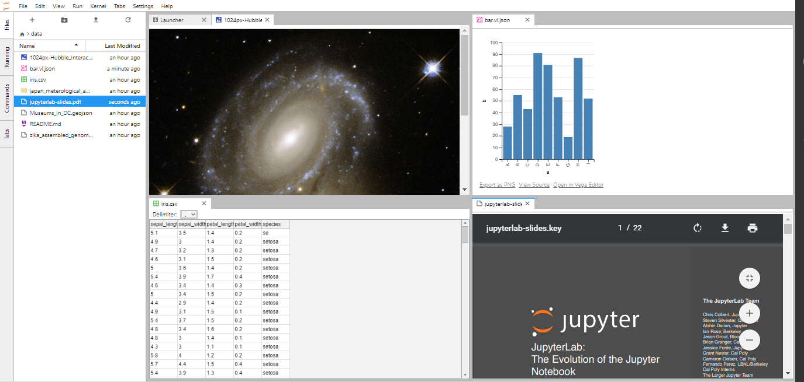    

### Task 8: Lights Off Lights On    
#### 1. In case you forget the commands, don’t worry. JupyterLab has a fuzzy search via the Commands tab. In the Commands tab, search for “dark” and click on Jupyter Dark Theme.    
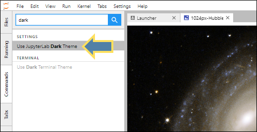

#### 2. This would have changed to Dark Theme. To revert, just search for “light” and click on Jupyter Light Theme.

    
>Note that this is by no means an exhaustive run through of JupyterLab features. We hope it gives you an idea and inspires you to use this tool also for your productive data wrangling and analysis.

>If you’d like to know more about JupyterLab, you can explore the team’s documentation here: http://jupyterlab.readthedocs.io/en/latest/getting_started/overview.html 
